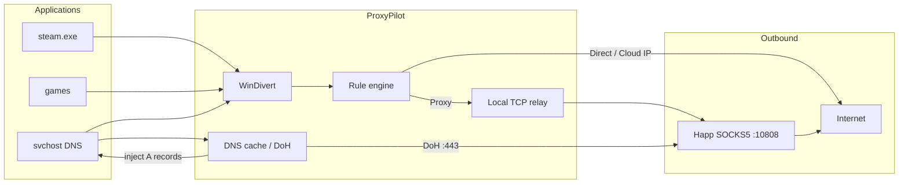

# ProxyPilot

**Transparent per-process proxy client for Windows.**  
Force apps that have no proxy settings — Steam, launchers, games — through SOCKS5, SOCKS4 or HTTP CONNECT.

[](https://github.com/daaag0n00969/ProxyPilot/actions/workflows/ci.yml)
[](https://dotnet.microsoft.com/)
[](LICENSE)
[](#)

<p align="center">
  <em>Proxifier-style rules. WinDivert packet intercept. Designed to work with local stacks such as Happ / xray.</em>
</p>

---

## Why

Windows has no system SOCKS5. Browsers can use a proxy; Steam, game launchers and many native apps cannot. ProxyPilot sits in front of the TCP stack, matches **process + destination**, and either:

- sends the connection through a SOCKS/HTTP proxy,
- lets it go **direct**, or
- **blocks** it.

Steam Cloud is a known pain point: the client resolves `*.blob.core.windows.net` via `svchost.exe`, not `steam.exe`. ProxyPilot answers those DNS queries (cache + DNS-over-HTTPS on port 443) and then lets Azure blob TCP go direct when the path is reachable — so cloud saves actually finish.

## Features

| | |
|---|---|
| **Intercept** | Outbound IPv4 TCP via [WinDivert](https://www.reqrypt.org/windivert.html) |
| **Proxies** | SOCKS5 (optional auth), SOCKS4, HTTP CONNECT, proxy chains |
| **Rules** | First match wins: process name / glob, IP, CIDR, port, hostname |
| **Actions** | Direct · Proxy · Block |
| **DNS** | Seeded cache, DoH through the proxy on **:443** (Happ-friendly; port 53 is often blocked) |
| **Steam Cloud** | Fake-IP of the local stack is proxied with the real hostname; Azure blob IPs can go direct |
| **Profiles** | JSON + import of Proxifier `.ppx` |
| **Ops** | Connection log, proxy probe, tray, `%AppData%\ProxyPilot\engine.log` |

Not in v1: UDP proxying, IPv6, NTLM, Windows service mode.

## Architecture



## Requirements

- Windows 10/11 **x64**
- [.NET 8 Desktop Runtime](https://dotnet.microsoft.com/download/dotnet/8.0) (or SDK to build)
- **Administrator** — the WinDivert driver will not load otherwise
- A SOCKS5/HTTP proxy, e.g. Happ listening on `127.0.0.1:10808`

## Install

Download **ProxyPilot-Setup-*-x64.exe** from [Releases](https://github.com/daaag0n00969/ProxyPilot/releases). The setup is self-contained (no separate .NET install), requires Administrator, and puts shortcuts in the Start menu.

After install, the folder looks like this:

```
C:\Program Files\ProxyPilot\
  ProxyPilot.exe     ← start this
  bin\               runtime, WinDivert, main app
```

To build the installer locally (Inno Setup 6 + .NET 8 SDK):

```powershell
.\installer\build.ps1
```

## Run from source

```powershell
dotnet build ProxyPilot/ProxyPilot.csproj -c Release
# then start as Administrator:
.\ProxyPilot\bin\Release\net8.0-windows\ProxyPilot.exe
```

Or double-click `Запустить ProxyPilot.bat` (UAC prompt).

1. Start your local proxy (Happ / xray).
2. Start ProxyPilot **as Administrator**.
3. Click **Запустить**.
4. Default profile routes `steam.exe`, `steamwebhelper.exe`, `steamservice.exe` and `GameOverlayUI.exe` through `127.0.0.1:10808`. Happ itself stays direct (loop protection).

Config: `%AppData%\ProxyPilot\profile.json`  
Log: `%AppData%\ProxyPilot\engine.log`

On first launch, if `~\Proxifier-Steam-Happ.ppx` exists, it is imported.

## Build & test

```powershell
dotnet test ProxyPilot.slnx -c Release
```

CI runs the same on `windows-latest`.

## Project layout

```
ProxyPilot.slnx
├── ProxyPilot/              WinForms UI (admin manifest)
├── ProxyPilot.Core/         rules, WinDivert, SOCKS, DNS, relay
├── ProxyPilot.Tests/        xUnit
└── third_party/WinDivert/   official 2.2.2-A x64 driver + LGPL license
```

## Configuration notes

- **Localhost / lancache** (`127.0.0.1`, `127.147.0.0/16`) stay direct so Steam downloads via a local content cache keep working.
- **Happ fake-IP** (`127.229.x`, `127.251.x`, …) is **not** treated as localhost — those connections are proxied with the original hostname in the SOCKS request.
- **Steam Cloud blob hosts** are resolved via DoH/cache; TCP to the resulting Azure IPs is direct when that path works.
- **Steam downloads / updates** (`*.steamcontent.com`, `*.steamserver.net`) are resolved via DoH through the proxy. Happ fake-IP ranges such as `127.147.0.0/16` are **proxied**, not treated as localhost.
- WinDivert filters cannot use `not (...)` groups; exclusions use `!=` or user-mode rules.

## Antivirus (Kaspersky and others)

Kaspersky may toast **WinDivert64.sys** with *«Expert analysis»* / *«may be used by attackers»*. That is a **heuristic**, not a malware signature.

WinDivert is a signed kernel driver that can intercept and inject packets. The same capability is used by malware, cheats, and DPI tools — so desktop AVs treat the driver as dual-use. ProxyPilot loads the **unmodified official** 2.2.2-A binary from `third_party/WinDivert/`.

Safe approach: add an exclusion for the project folder or for `WinDivert64.sys` + `ProxyPilot.exe`. Do not disable the whole product. Packing or patching the driver to hide it from AV is a bad idea.

Kaspersky: **Settings → Additional → Threats and Exclusions → Exclusions → Add folder**.

## License

- ProxyPilot source: [MIT](LICENSE)
- Bundled WinDivert: LGPL v3 / GPL v2 — see [NOTICE](NOTICE) and `third_party/WinDivert/LICENSE.txt`

## Acknowledgements

- [WinDivert](https://github.com/basil00/WinDivert) by basil00
- Rule/profile model inspired by [Proxifier](https://www.proxifier.com/)
